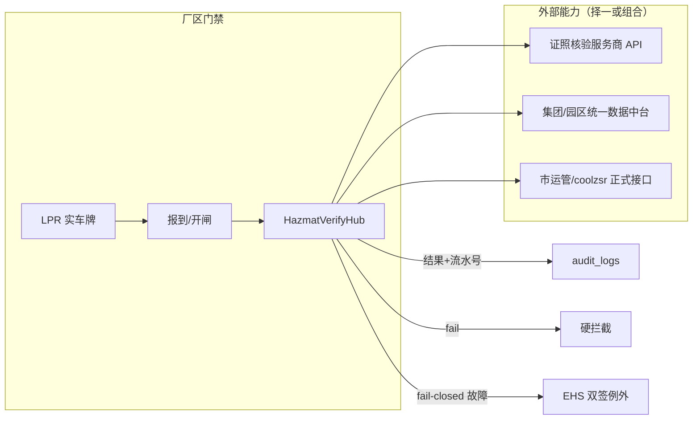

# 危货车辆资质与上海联网联控准入核验 · 对接优先方案

| 项 | 内容 |
|----|------|
| 目标 | 防过期证、防套牌嫌疑；上海危货准入可审计 |
| 原则 | **能对接的不靠人工记忆**；人工只补接口覆盖不到的缺口 |
| 日期 | 2026-07-22 |

---

## 1. 总体策略：一张核验总线

不直连「全国重点营运车辆联网联控平台」吃轨迹，而是建设厂区侧：

```
HazmatVerifyHub（危货核验总线）
  ├─ TransportPermitVerifier   道路运输证（车牌+颜色）
  ├─ DriverQualVerifier        危货从业资格（姓名+身份证/证号）
  ├─ CarrierLicenseVerifier    危货经营许可（承运商信用代码/许可证号）
  ├─ NetworkDirectoryVerifier  上海联网联控目录状态
  └─ WaybillMatcher            电子运单/DN ↔ 预约
```

业务只调 `HazmatVerifyHub.verify(ctx)`，换服务商只换 Adapter，不改门禁状态机。

**触发条件（避免所有车都查）：** 预约勾选 `hazmat`，或承运商标记为危货承运。

**放行铁律：** 任一项 `fail` → 硬拦截；接口超时/不可用 → **失败关闭（fail-closed）**，仅 EHS 双签例外。

---

## 2. 必查项：对接优先分工

| 对象 | 必查项 | 对接方式（优先） | 人工兜底（仅当无通道时） |
|------|--------|------------------|--------------------------|
| 车 | 车牌 + 颜色 | **门岗 LPR / 相机对接**（实车为准） | 门岗手输并二次确认 |
| 车 | 道路运输证有效 | **证照核验 API**（车牌+颜色[+证号]） | 禁止长期依赖；过渡期可 OCR+人工，但标「未权威核验」不得危货放行 |
| 车 | 危货标识/经营范围 | API 若返回经营范围则自动比对；否则 **门岗清单勾选**（仍算现场核验，结果进系统） | 目视勾选 |
| 车 | 上海联网联控目录 | **优先**：服务商/市侧「目录或联控状态」接口；**次选**：集团已有政务通道 | EHS 查网页 → 写 `directory_verified_at`（带有效期，如 90 天） |
| 人 | 危货从业资格有效 | **资格证核验 API** | 同运输证，过渡策略一致 |
| 人 | 与当前司机一致 | **系统自动**：登录身份 vs 核验返回姓名/证号；**门岗对接**：可选身份证阅读器/人脸 | 门岗「人证一致」勾选 |
| 户 | 经营许可有效 | **经营许可核验 API**，按承运商缓存 7～30 天 | 年审时人工录入效期 |
| 单 | 电子运单/DN | **内部对接**预约库 +（有则）危货电子运单平台；门岗/仓管确认勾选 | 现场核对纸质 |

---

## 3. 推荐对接拓扑（企业少折腾）



**采购建议（由易到难）：**

1. **先问集团/园区**是否已有运政核验或联控查询 → 复用，合规叙事最好。  
2. 否则 **招标 1 家企业级证照核验**（运输证 + 危货从业资格 + 尽量含经营许可）。  
3. 目录状态：写进同一招标「必须项/加分项」；若服务商暂无，再用「人工核验写回 + 有效期」Adapter。  
4. **不把「直连部联网联控轨迹」写进一期范围。**

---

## 4. 统一接口契约（给开发 / 服务商）

```ts
// POST 内部：hazmatVerify(ctx)
input: {
  plateNo, plateColor,           // 必填，来自 LPR
  transportPermitNo?,            // 可选，提高匹配率
  driverName, driverIdNo,        // 资格证核验
  qualCertNo?,
  carrierCreditCode?,            // 经营许可
  carrierLicenseNo?,
  pickupRef?,                    // DN / 电子运单号
  visitId?
}

output: {
  ok: boolean,
  lights: {
    vehiclePermit: 'pass'|'fail'|'unknown',
    driverQual: 'pass'|'fail'|'unknown',
    carrierLicense: 'pass'|'fail'|'unknown',
    networkDirectory: 'pass'|'fail'|'unknown'|'manual_cached',
    waybill: 'pass'|'fail'|'unknown',
    identityMatch: 'pass'|'fail'|'unknown'
  },
  reasons: [{ code, message }],
  provider: string,              // 服务商标识
  requestId: string,             // 对方流水，审计用
  rawRef?: string,               // 脱敏存证指针
  checkedAt: ISO8601
}
```

**映射到现有准入：**

- 增加第四灯 `hazmat`（或并入 `documents` 但原因码独立）。  
- 原因码示例：`HAZMAT_PERMIT_EXPIRED`、`HAZMAT_PERMIT_MISMATCH`（套牌嫌疑）、`HAZMAT_QUAL_EXPIRED`、`HAZMAT_QUAL_PERSON_MISMATCH`、`HAZMAT_DIR_NOT_LISTED`、`HAZMAT_PROVIDER_DOWN`。

---

## 5. 防套牌 / 过期：对接怎么用

| 风险 | 对接动作 |
|------|----------|
| 过期证 | 放行瞬间调运输证/资格证 API，**以接口状态为准**，覆盖本地 OCR 日期 |
| 套牌 | **LPR 实车牌** 作为唯一查询键；接口返回「证号与车牌不一致 / 非营运」→ `MISMATCH` 拦截 |
| 借证替驾 | 资格证核验姓名/身份证 vs 当前登录司机；不一致拦截 |
| 目录造假勾选 | 有目录接口则实时查；无接口则 `manual_cached` 且超期作废，抽检可取消 |

本地上传证照：**只作建档与预警，危货放行不得仅凭本地效期。**

---

## 6. 缓存与频控（控成本、仍合规）

| 数据 | 缓存 | 说明 |
|------|------|------|
| 经营许可（户） | 7～30 天 | 变化慢 |
| 运输证 / 资格证 | **当日或至效期日较短者** | 危货建议每次开闸前至少成功核验 1 次 |
| 目录状态 | 接口实时；人工缓存 ≤ 90 天 | 人工模式必须带核验人/附件 |
| 失败结果 | 不长期缓存为 pass | 避免「曾经失败却放行」 |

---

## 7. 分阶段落地（对接主线）

| 阶段 | 对接内容 | 人工残留 |
|------|----------|----------|
| **M1** | 定 Hub 契约 + Mock Adapter；LPR 车牌进核验上下文；危货硬拦 + 审计字段 | 目录人工写回；人证门岗勾选 |
| **M2** | 接通运输证 + 从业资格 API（主防过期/套牌） | 目录仍可人工 |
| **M3** | 经营许可 API 缓存；目录/联控状态接口（若招标拿到） | 仅现场车貌异常 |
| **M4** | 身份证阅读器/人脸（可选）；电子运单平台对接 | 极少例外双签 |

---

## 8. 与现有代码的衔接点

| 现有能力 | 对接后 |
|----------|--------|
| `evaluateAccess` + `hazmat` 选件 | 危货时异步/同步调用 `HazmatVerifyHub`，失败写入 `reasons` |
| `devices/hub` LPR | `capturePlate` 结果作为 `plateNo/plateColor` 传入核验 |
| `documents` OCR | 降级为辅证；权威结果来自 Verifier |
| `exception_*` 双签 | 专用于 `HAZMAT_PROVIDER_DOWN` 或特批，不可用于「证已过期仍放行」常态 |
| `audit_logs` | 记录 `provider/requestId/lights` |

实现时建议新增：

- `server/src/services/hazmatVerify/`（hub + mock + http 适配器）  
- `web/src/mockApi.js` 对称 mock  
- 设置项：`hazmat_verify_mode = mock|http|off`，`hazmat_fail_closed = true`

---

## 9. 对外话术（采购 / 交通口）

> 我方不建设营运车辆监控中心，仅在危货车辆入厂环节，通过授权数据服务或政务共享通道，按**实车车牌**核验道路运输证、危货从业资格及（可提供时）上海联网联控准入状态，核验失败不予放行并全程留痕。

---

## 10. 决策结论

- **尽量对接**：运输证、资格证、经营许可、（争取）目录状态、LPR、运单号校验。  
- **不得不人工**：无目录接口时的目录查验写回；接口未覆盖的车貌；人证「是否本人」在上生物识别前。  
- **系统始终自动**：拦截、缓存失效、审计、例外门禁。

*下一步可在仓库落地 `HazmatVerifyHub` Mock，并与 `evaluateAccess` 第四灯联调。*
