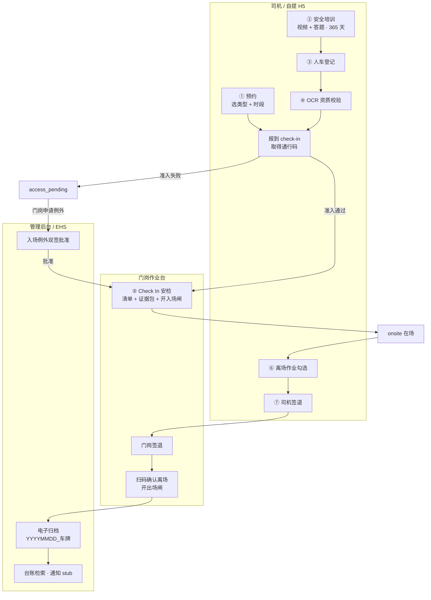
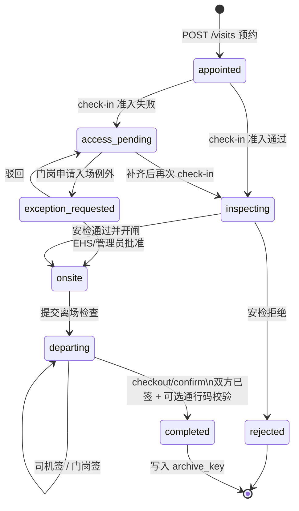
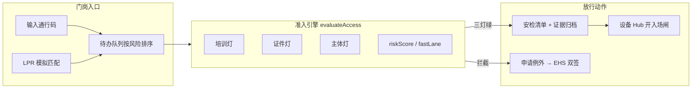
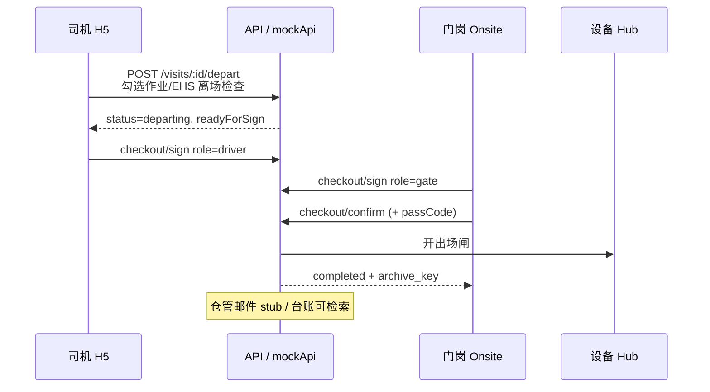
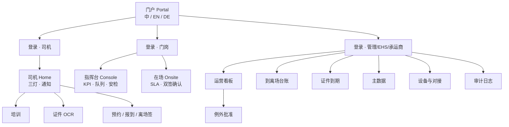
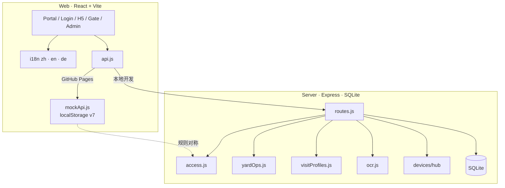
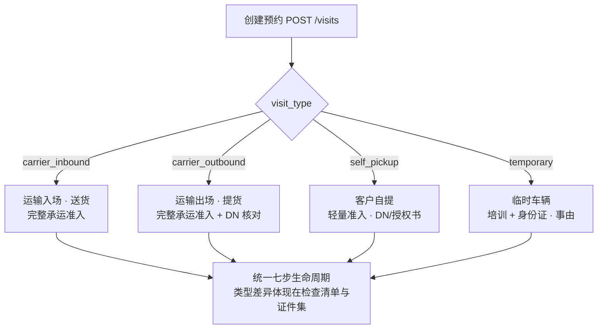
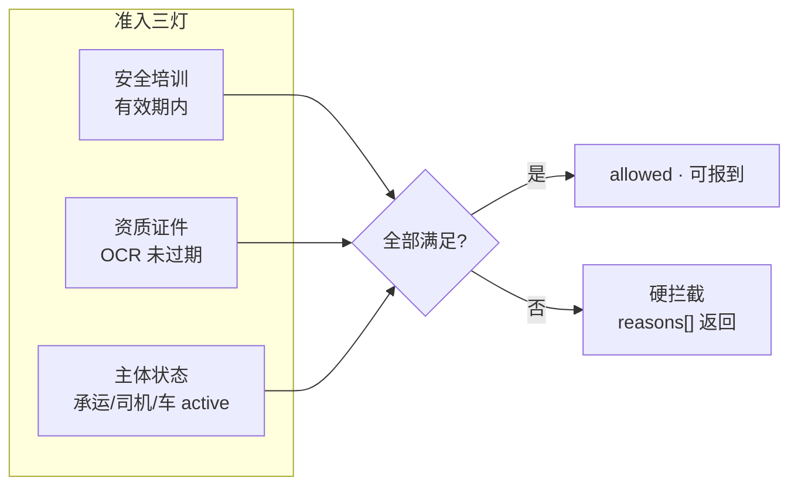

# EHS数字化管理系统 · 系统流程图

| 项 | 内容 |
|----|------|
| 产品 | EHS数字化管理系统 / EHS Digital Management System |
| 配套文档 | [设计与开发文档.md](./设计与开发文档.md) |
| 日期 | 2026-07-22 |

本文集中放置可渲染的 **Mermaid** 流程图；GitHub / VS Code / Cursor 均可预览。

---

## 1. 总体业务闭环（七步生命周期）

---

## 2. 到访状态机（完整）

---

## 3. 入场路径（通行码 / LPR / 例外）

---

## 4. 离场双签路径

---

## 5. 角色与端侧地图

---

## 6. 系统技术架构

---

## 7. 业务类型分流

---

## 8. 准入三灯与硬拦截

---

*与实现不一致时，以仓库代码与 `npm run selfcheck:all` 为准。*
